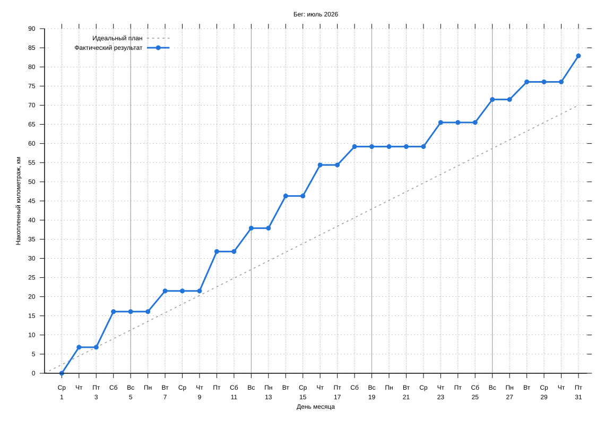

#+startup: inlineimages

#+name: running-log
|       date | distance |
|------------+----------|
| 2026-07-02 |      6.8 |
| 2026-07-04 |      9.3 |
| 2026-07-07 |      5.4 |
| 2026-07-10 |     10.3 |
| 2026-07-12 |      6.1 |
| 2026-07-14 |      8.4 |
| 2026-07-16 |      8.1 |
| 2026-07-18 |      4.8 |
| 2026-07-23 |      6.3 |
| 2026-07-26 |        6 |
| 2026-07-28 |      4.6 |
| 2026-07-31 |      6.8 |

#+name: running-config
|   month | target_km |
|---------+-----------|
| 2026-07 |        70 |
|---------+-----------|

# Local Variables:
# eval: (load (expand-file-name "../running-chart.el" (file-name-directory buffer-file-name)) nil 'nomessage)
# End:
