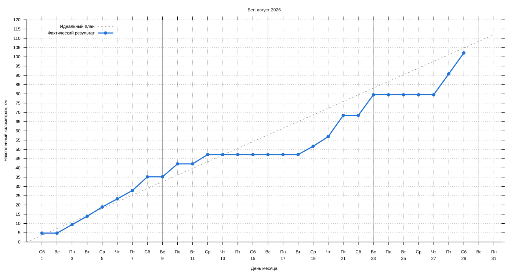

#+startup: inlineimages

#+name: running-log
|       date | distance |
|------------+----------|
| 2026-08-01 |      4.8 |
| 2026-08-03 |      4.6 |
| 2026-08-04 |      4.5 |
| 2026-08-05 |        5 |
| 2026-08-06 |      4.4 |
| 2026-08-07 |      4.5 |
| 2026-08-08 |      7.4 |
| 2026-08-10 |        7 |
| 2026-08-12 |        5 |
| 2026-08-19 |      4.5 |
| 2026-08-20 |      5.2 |
| 2026-08-21 |     11.5 |
| 2026-08-23 |     11.1 |
| 2026-08-28 |     11.3 |
| 2026-08-29 |     11.3 |

#+name: running-config
|   month | target_km |
|---------+-----------|
| 2026-08 |       112 |
|---------+-----------|

# Local Variables:
# eval: (load (expand-file-name "../running-chart.el" (file-name-directory buffer-file-name)) nil 'nomessage)
# End:
