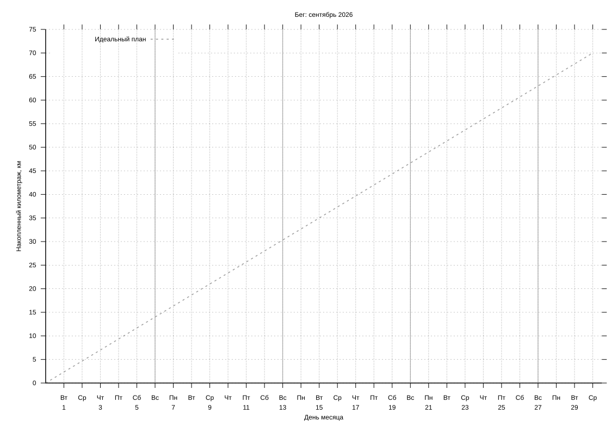

#+startup: inlineimages

#+name: running-log
|       date | distance |
|------------+----------|

#+name: running-config
|   month | target_km |
|---------+-----------|
| 2026-09 |       70  |
|---------+-----------|

# Local Variables:
# eval: (load (expand-file-name "../running-chart.el" (file-name-directory buffer-file-name)) nil 'nomessage)
# End:
