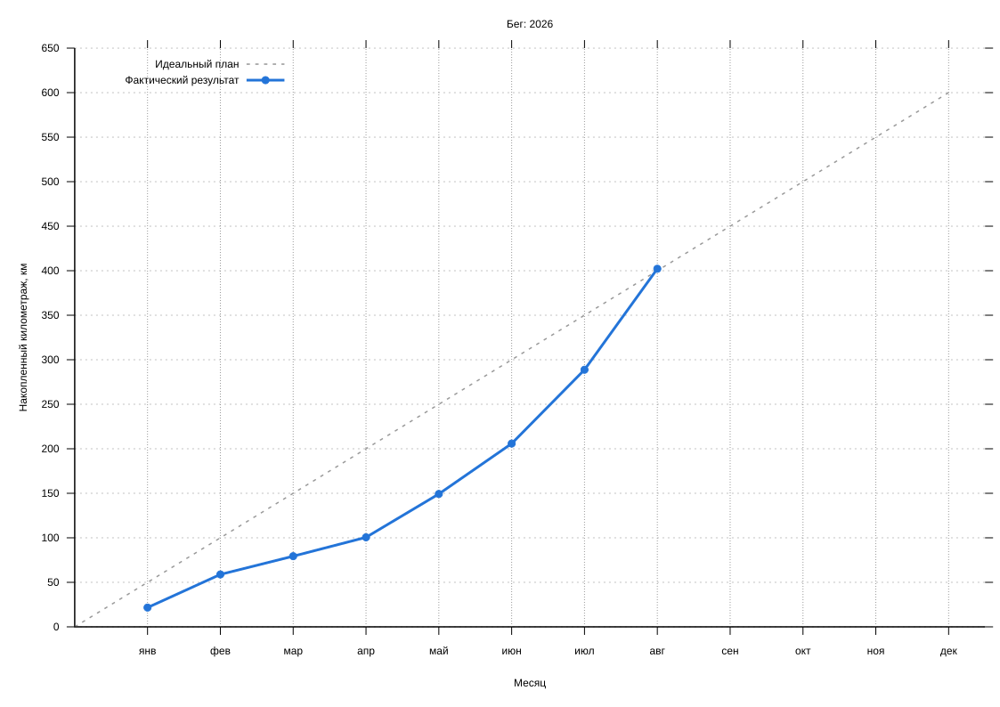

#+startup: inlineimages

#+name: running-months
|   month | distance |
|---------+----------|
| 2026-01 |    21.66 |
| 2026-02 |    37.22 |
| 2026-03 |    20.48 |
| 2026-04 |     21.2 |
| 2026-05 |     48.7 |
| 2026-06 |     56.6 |
| 2026-07 |     82.9 |
| 2026-08 |    113.4 |
| 2026-09 |          |
| 2026-10 |          |
| 2026-11 |          |
| 2026-12 |          |

#+name: running-config
| year | target_km |
|------+-----------|
| 2026 |       600 |
|------+-----------|

# Local Variables:
# eval: (load (expand-file-name "../running-chart.el" (file-name-directory buffer-file-name)) nil 'nomessage)
# End:
